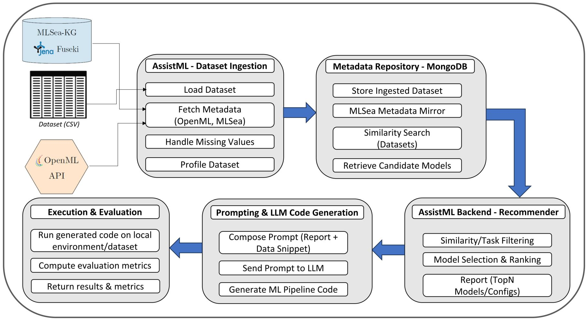

# SEDAR-ML

**SEDAR-ML** is a research repository that consolidates three complementary approaches for automating and enhancing Machine Learning workflows within the **SEDAR** semantic data lake framework.  
The project explores different levels of automation — from traditional AutoML to LLM-driven code generation and knowledge-graph-enhanced reasoning — to advance the integration of semantic data management and intelligent ML assistance in Industry 4.0 settings.

1. **AutoMLWrapper** – a standardized interface for open-source AutoML frameworks (AutoKeras, AutoGluon, AutoSklearn), enabling uniform configuration, experiment tracking, and MLFlow integration.  
2. **LLM-orchestrated ML** – a pipeline that leverages large language models to autonomously generate ML code inside the SEDAR environment, integrating profiling results and metadata through LangChain and JupyterAI.  
3. **AssistML** – the *KG-enhanced Data Science Agent* approach, combining metadata from OpenML and the MLSea Knowledge Graph to generate semantically grounded model recommendations and hyperparameter configurations.

Together, these three components form a unified research environment for studying the interplay between **AutoML**, **LLM-based orchestration**, and **Knowledge-Graph-driven Data Science Agents** within semantic data ecosystems.

---

# AutoMLWrapper

This repo contains supporting information, code and the datasets for our publication [Enhancing Machine Learning Capabilities in Data Lakes with AutoML and LLMs](https://link.springer.com/chapter/10.1007/978-3-031-70626-4_13).

The AutoMLWrapper is a Python module acting as an interface for three open-source AutoML frameworks: AutoKeras, AutoGluon and AutoSklearn.
Special emphasis is placed on the standardized construction of AutoML jobs by configuring the underlying libraries using a common set of parameters.
Object-oriented programming for library-unspecific logic facilitates easy integration of new AutoML libraries without redesigning the entire interface.

# AssistML
AssistML is a system for recommending machine learning (ML) solutions, designed as a lightweight alternative to traditional AutoML frameworks.
Instead of fully automating model training, AssistML leverages metadata from OpenML and the MLSea Knowledge Graph Collection to identify suitable ML models and hyperparameter configurations for new datasets.

In our project, AssistML was used to ingest and profile datasets, search for similar datasets via MLSea, and generate model recommendations based on these insights.
The resulting report - containing the recommended model type and hyperparameter configuration - was then used as a prompt for a Large Language Model (LLM), which generated the complete Python code implementation for the suggested ML pipeline.



A related follow-up publication, *Towards Enhancing Data Science Agents with Semantics*, authored by Sayed Hoseini, Maximilian Ibbels, Maximilian Knoll, and Christoph Quix, extends the project’s research focus towards comparing the three different approaches which are also discussed in this project.

## AssistML Setup (Docker)
This repository contains a dockerized version of the project.

### Prerequisites

- Docker
- Docker Compose
- MongoDB Database Tools

### Installation and Start

1. Change to assistml after cloning the SEDAR-ML project repository:
    ```bash
    cd assistml
    ```

2. Make sure that at minimum, that the required Python packages from the provided __requirements.txt__ are installed:
    ```
    pip install -r requirements.txt
    ```

3. Build and start the Docker containers:
    ```bash
    docker-compose up --build
    ```

4. The application should now be running and accessible at `http://localhost:8050`.

### Docker Commands

- To stop the containers:
    ```bash
    docker compose down
    ```

- To start the containers in the background:
    ```bash
    docker compose up -d
    ```

- To view the logs of the containers:
    ```bash
    docker compose logs
    ```

### Restore MongoDB backup
The repository of assistml contains a file __mongodb.backup.gz__ including datasets of OpenML and machine learning components of MLSea-KG. This backup has to be restored once before first usage of AssistML.

For that make sure to work from within the __assistml__-repository, then run the following command:
```bash
mongorestore --gzip --archive=assistml/mongodb.backup.gz
```
This will automatically connect to the default port __27017__, where the MongoDB is running on. After a successful restore, the database will contain all required metadata to enable dataset ingestion, profiling, and recommendation functionality in AssistML.

### Credits AssistML
The experimental codebase of the AssistML module originates from the [AssistML project](https://github.com/MorpheusI0/assistml/tree/main) by [Maximilian Knoll](https://github.com/MorpheusI0).

# Notebooks
The folder notebooks contains the the Jupyter Notebooks to conduct the evaluation. They were generated in parts by the [SEDAR](https://github.com/hsnr-data-science/SEDAR) backend and can be executed alongside the [SEDAR default image](https://hub.docker.com/r/mxibbls/gpu-jupyter-mlflow/) (stable tag). 

# Training Details

All experiments are performed in a Jupyter environment of the server discussed in the paper. 
The server is equipped with two Nvidia Quadro RTX 8000 graphics cards, each of which has 48GB of graphics memory available. 
The server also has two Intel Xeon Gold 6230R processors, each with 26 cores and 754 GB of RAM.
Training for all models is initially limited to one hour. For the AutoKeras library, for which no time limit can be defined, a division into 20 models for 30
epochs is used. Except for one model, all LLMs in GPT4All are designed for the English language. The
Conversations with the LLMs are therefore uniformly conducted in English.

## License

This work is licensed under a
[Creative Commons Attribution 4.0 International License][cc-by].

[![CC BY 4.0][cc-by-image]][cc-by]

[cc-by]: http://creativecommons.org/licenses/by/4.0/
[cc-by-image]: https://i.creativecommons.org/l/by/4.0/88x31.png


## Acknowledgments
Sayed Hoseini, Maximilian Ibbels and Christoph Quix contribute to the initial [paper](https://link.springer.com/chapter/10.1007/978-3-031-70626-4_13).<br>
These authors also contributed to the follow-up publication, which was additionally authored by Maximilian Knoll.<br>
Vincent Herrmann contributed to the integration and evaluation of AssistML within the SEDAR-ML framework.<br>
The authors acknowledge gratefully the cooperation with the HIT Institute which made this work possible. <br>
This work has been sponsored by the German Federal Ministry of Education and Research, Germany in the funding program “Forschung an Fachhochschulen”, project IDACH (grant no. 13FH557KX0, [i2DACH](https://www.hs-niederrhein.de/i2dach) ).


## Citing
If you use this work in your research or wish to refer to the baseline results published here, please use the following BibTeX entries:

*Enhancing Machine Learning Capabilities in Data Lakes with AutoML and LLMs*
```bibtex
@inproceedings{hoseini2024automl,
  author    = {Hoseini, Sayed Massih and Ibbels, Maximilian and Quix, Christoph},
  title     = {Enhancing Machine Learning Capabilities in Data Lakes with AutoML and LLMs},
  booktitle = {Advances in Databases and Information Systems (ADBIS 2024)},
  editor    = {Tekli, Joe and Gamper, Johann and Chbeir, Richard and Manolopoulos, Yannis},
  series    = {Lecture Notes in Computer Science},
  volume    = {14918},
  pages     = {177--191},
  publisher = {Springer},
  address   = {Cham},
  year      = {2024},
  doi       = {10.1007/978-3-031-70626-4_13},
  url       = {https://link.springer.com/chapter/10.1007/978-3-031-70626-4_13}

}
```
*Towards Enhancing Data Science Agents with Semantics*
```bibtex
@article{hoseini2025semantics_agents,
  author    = {Hoseini, Sayed Massih and Ibbels, Maximilian and Quix, Christoph},
  title     = {Towards Enhancing Data Science Agents with Semantics},
  journal   = {Computer Science and Information Systems},
  year      = {2025},
  note      = {OnLine-First},
  publisher = {Computer Science and Information Systems},
  doi       = {10.2298/CSIS250320078H},
  url       = {https://www.researchgate.net/publication/398383838_Towards_enhancing_data_science_agents_with_semantics}
}
```
